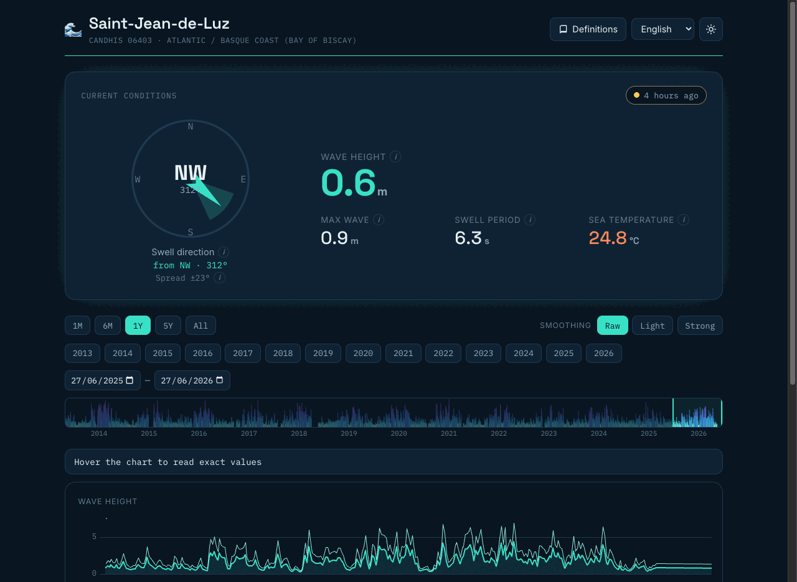

# 🌊 Olatu

> *Olatu* — Basque for "wave".

A fast, beautiful, **fully static** web app to read what the sea is doing at the
**Saint-Jean-de-Luz wave buoy** (Atlantic / Basque coast) — right now, and across
its whole history since 2013.

No backend, no account, no API key. Data is read straight from Parquet committed in
this repo and rendered in your browser. Deployed on GitHub Pages.



- **Live:** https://hadim.github.io/olatu/
- **Data source:** [CANDHIS](https://candhis.cerema.fr) — the French national
  in-situ wave-measurement network, operated by [Cerema](https://www.cerema.fr).
  Buoy **06403, Saint-Jean-de-Luz** (43.408° N, 1.682° W), ~3 km off the Belharra
  reef, one measurement every 30 minutes.

> 🚧 **Status: active development.** Rebuilt from scratch for a much nicer UX and
> pixel-perfect data-viz. The data pipeline is done and the new frontend is live:
> current-conditions banner, synced uPlot charts with a heat-ribbon timeline,
> a mini-map, a definitions glossary, dark/light themes and EN/FR/ES. Still on the
> roadmap: 30-min detail, the lazy MapLibre expanded map, and the Paraglide i18n
> migration. See [`specs/`](specs/) for the plan and decisions.

## What it does

- **Current conditions at a glance** — wave height, swell direction, period and sea
  temperature, with a clear "how fresh is this reading?" indicator.
- **Time travel** — today, yesterday, this week, this month, any past year, or a
  precise custom date range.
- **Every value explained** — a plain-language definition for each variable, so you
  always know what you're looking at.
- **A map** of where the buoy sits.
- **Multilingual** — English, French, Spanish.
- **Desktop and mobile**, both first-class.

## How it's built

| Layer | Tech |
|-------|------|
| Frontend | React + Vite + TypeScript, Tailwind CSS, **uPlot** (canvas charts), MapLibre (map), Paraglide (i18n) |
| Data in the browser | [hyparquet](https://github.com/hyparam/hyparquet) — reads Parquet directly, no WASM |
| Data pipeline | **Python + [polars](https://pola.rs)** (CSV → cleaned, tiered Parquet/JSON), managed by [pixi](https://pixi.sh) |
| Hosting | GitHub Pages (static) |

## Repository layout

```
ingest/              Python (polars) pipeline: CANDHIS CSV → tiered Parquet/JSON
webapp/              the frontend
  public/data/       generated data tiers (committed): manifest/latest/recent.json, year/*.parquet, hourly/daily.parquet
specs/               design & decision records (this project is spec-driven)
```

## Getting started

### Data pipeline

Requires [pixi](https://pixi.sh).

```bash
pixi install
pixi run ingest --src /path/to/candhis/csv
```

This reads `Candhis_06403_*_arch.csv` (archive) and `Candhis_06403_*_reel.csv`
(realtime) and produces the cleaned, tiered files in `webapp/public/data/`.

### Frontend

`pixi` bundles Node, so no separate install is needed:

```bash
pixi run webapp          # start the local dev server
pixi run webapp-build    # static build for GitHub Pages
```

(Or use npm directly inside `webapp/`: `npm install && npm run dev`.)

## Contributing & bug reports

Contributions, ideas and bug reports are very welcome — please
[open an issue](https://github.com/hadim/olatu/issues) or a pull
request.

## License & attribution

- **Code** is released under the [MIT License](LICENSE).
- **Wave data** is © **Cerema / CANDHIS** and is provided under the CANDHIS
  [conditions of use](https://candhis.cerema.fr/doc/01_Utilisation.fr.pdf). This is
  an independent community viewer and is **not** an official Cerema/CANDHIS product.
