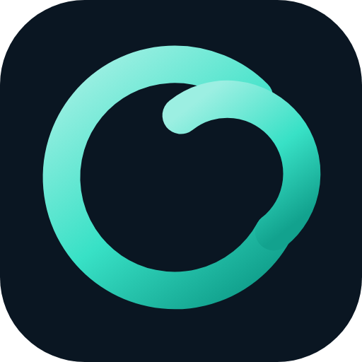
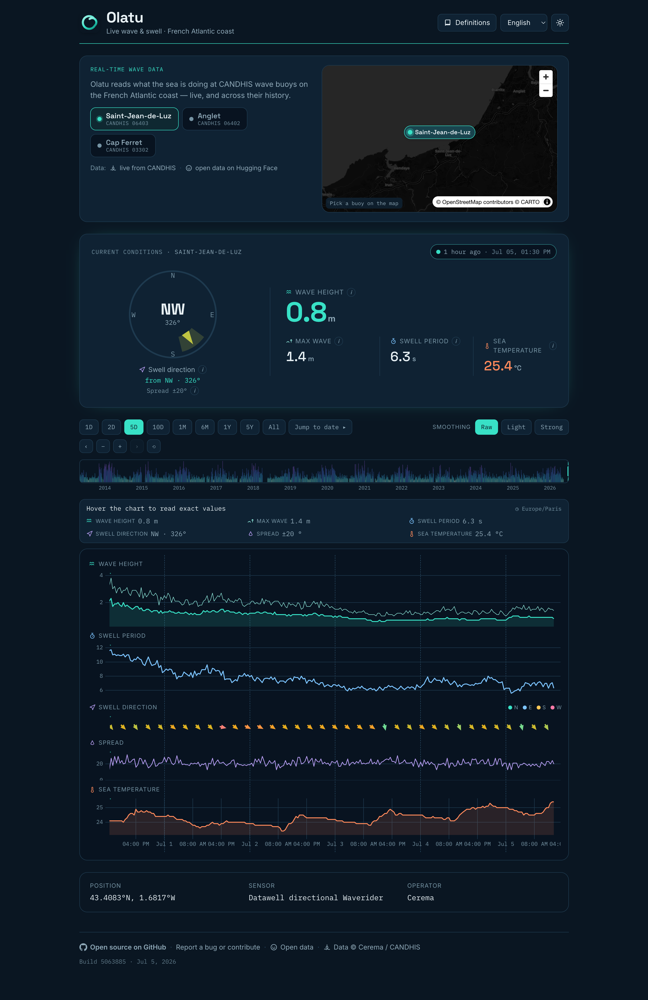

#  Olatu

> *Olatu* — Basque for "wave". **[olatu.io](https://olatu.io)**

A fast, **fully static** web app for the sea state at the **CANDHIS wave buoys of the
French Atlantic coast** — live and historical. No backend, no account, no API key: the
browser reads tiered Parquet/JSON straight from an open Hugging Face bucket and renders it
with pixel-perfect canvas charts. Deployed on GitHub Pages.



**Buoys** (switch on the map; shareable via `?buoy=<id>`):

| Buoy | Id | Position | History |
|------|----|----------|---------|
| Saint-Jean-de-Luz *(default)* | 06403 | 43.408° N, 1.682° W | full, from 2013 |
| Anglet | 06402 | 43.532° N, 1.615° W | full, from 2009 |
| Cap Ferret | 03302 | 44.653° N, 1.447° W | realtime-only, accumulating forward |

Data © **[Cerema / CANDHIS](https://candhis.cerema.fr)** (Datawell directional Waverider
buoys, one measurement / 30 min). The cleaned tiers are re-scraped every 30 min into the
public HF bucket **[`hadim/olatu`](https://huggingface.co/buckets/hadim/olatu)** (CORS
Parquet/JSON) and reusable by anyone.

## Features

- **Switch buoys** on a live map or a segmented control — the choice is remembered and in
  the URL.
- **Current conditions** — wave height, swell direction / period, sea temp, with a "how
  fresh is this reading?" state; auto-refreshes every ~5 min.
- **Time travel** — 1D → all-years, or a custom range, down to 30-minute detail.
- **Every value explained** (glossary), **EN / FR / ES**, **dark / light**, desktop &
  mobile, AA-contrast.

## Stack

React + Vite + TypeScript · **uPlot** canvas charts · MapLibre (lazy) · Tailwind v4 +
shadcn/Radix · Paraglide i18n · [hyparquet](https://github.com/hyparam/hyparquet)
(Parquet-in-browser, no WASM). Pipeline: **Python + [polars](https://pola.rs)** via
[pixi](https://pixi.sh). The site and its data are **decoupled** — the 30-min refresh
re-uploads to HF without rebuilding or redeploying the webapp.

## Quickstart

Requires [pixi](https://pixi.sh) (it bundles both the Python env and Node).

```bash
pixi run webapp                      # frontend dev server (reads data live from HF)
pixi run webapp-build                # static build for GitHub Pages
pixi run check                       # ruff format + lint (Python)

pixi run update                      # pull → scrape → build → upload to HF (campaign 06403)
pixi run update --campaign 06402     # …for another buoy
```

`update` is the usual data refresh (same command locally and in CI). Lower-level
`pixi run scrape` / `pixi run ingest` work on a local `./hfdata/<campaign>/{raw,data}`
mirror. Override the webapp's data root with `VITE_DATA_BASE_URL` (must end in `/`).

## Layout

```
ingest/     Python (polars): CANDHIS CSV/HTML → tiered Parquet/JSON, per --campaign
  schema.py   buoy registry (BUOYS) + column mapping   scrape.py  live-feed reel
  build.py    tiers                                     update.py  pull→scrape→build→upload
webapp/     frontend (reads tiers from the HF bucket at runtime)
  src/lib/buoys.ts   buoy registry powering the switcher + locator map
specs/      design & decision records — read these first (this project is spec-driven)
.github/workflows/   deploy.yml (Pages, on webapp change) · refresh-data.yml (data, */30)
```

Data is **not** in git — it lives in the HF bucket as `<campaign>/raw/*.csv` (sources) +
`<campaign>/data/…` (the tiers the webapp fetches). See [`specs/`](specs/) for the full
design, and [`CLAUDE.md`](CLAUDE.md) for conventions.

## Contributing & license

Issues and PRs welcome → [github.com/hadim/olatu](https://github.com/hadim/olatu/issues).
**Code:** [MIT](LICENSE). **Wave data:** © Cerema / CANDHIS under the CANDHIS
[conditions of use](https://candhis.cerema.fr/doc/01_Utilisation.fr.pdf) — this is an
independent community viewer, **not** an official Cerema/CANDHIS product.
